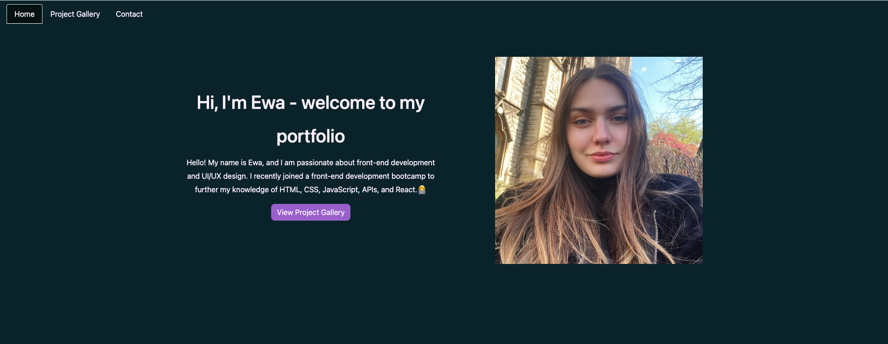

# Team-Profile-Generator
 

Week 13 challenge of the Front-End Development Bootcamp
  ## Description
 A portfolio website created with React.js . The website right now isn't finished yet, it needs a lot work done to it. One of the biggest featues to add is implementing pages with more details for each project (now when you click on the project card it will display an error page)

   ## Description
   Deployed website link: https://ewagorka.github.io/portfolio-ewagorka

  ## Deployed website screenshot
 
 
  ## License

  This project uses the MIT license

  ## Credits
A lot of the code I used to create this page is based on the activities we completed during the classes.

